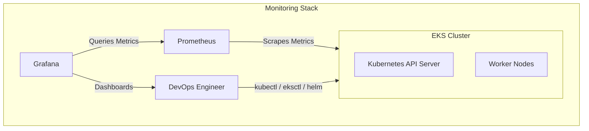
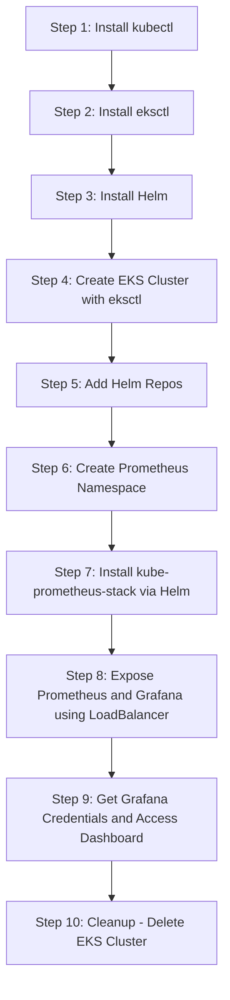

# Monitoring Kubernetes (EKS) with Prometheus and Grafana

This repository demonstrates how to set up **cluster monitoring** for Amazon EKS using **Prometheus** (metrics collection) and **Grafana** (visualization).

It contains:

* Introductions to Prometheus & Grafana
* Why Helm is important for Kubernetes deployments
* Step-by-step installation guide for monitoring stack
* Grafana dashboards for real-time insights into your cluster

---

## 🏗️ System Architecture



---

## ⚙️ Setup Workflow



---

## 📂 Repository Structure

```
.
├── 01_Intro_Prometheus.md      # Basics of Prometheus
├── 02_Intro_Grafana.md         # Basics of Grafana
├── 03_Why_Helm.md              # Why Helm is required for K8s apps
├── 04_Installation_steps.md    # Detailed installation guide
└── README.md                   # Main overview (this file)
```

---

## 🚀 Quick Start (High-level)

1. **Install CLI tools**

   * `kubectl` → manage Kubernetes
   * `eksctl` → create/manage EKS clusters
   * `helm` → package manager for Kubernetes

2. **Create an EKS Cluster**

   ```bash
   eksctl create cluster --name=eks-cluster --region=ap-south-1 \
     --version=1.29 --nodegroup-name=my-nodes --node-type=t3.medium --nodes=2
   ```

3. **Deploy Monitoring Stack**

   ```bash
   kubectl create namespace prometheus
   helm repo add prometheus-community https://prometheus-community.github.io/helm-charts
   helm install stable prometheus-community/kube-prometheus-stack -n prometheus
   ```

4. **Expose Grafana**

   ```bash
   kubectl edit svc stable-grafana -n prometheus
   # Change ClusterIP → LoadBalancer
   ```

5. **Access Grafana Dashboard**

   * Username: `admin`
   * Password:

     ```bash
     kubectl get secret --namespace prometheus stable-grafana \
       -o jsonpath="{.data.admin-password}" | base64 --decode ; echo
     ```

---

## 📖 Documentation

* [Intro to Prometheus](01_Intro_Prometheus.md)
* [Intro to Grafana](02_Intro_Grafana.md)
* [Why Helm?](03_Why_Helm.md)
* [Installation Steps](04_Installation_steps.md)

---

## 🧹 Cleanup

To delete the cluster and avoid AWS charges:

```bash
eksctl delete cluster --name eks-cluster
```

---
